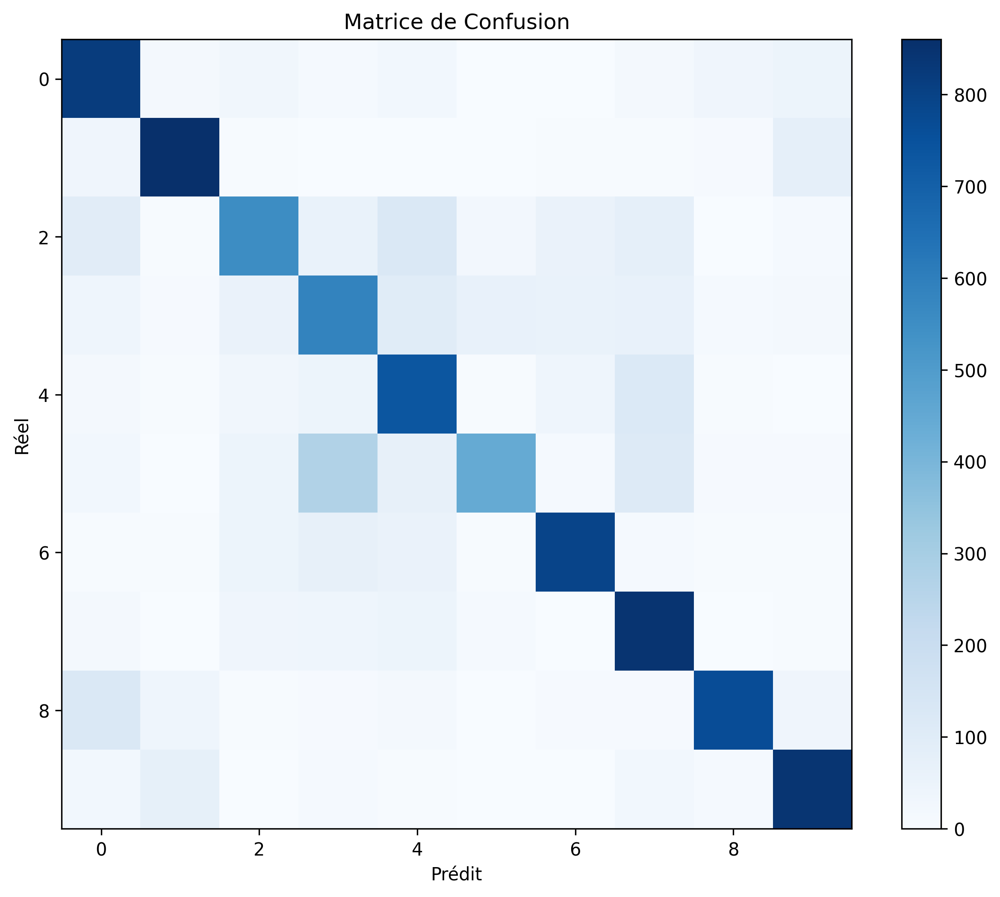

# 🧠 PyTorch Deep Learning — Custom CNN Architecture


Implémentation complète d'un réseau de neurones profond (*Convolutional Neural Network*) construit **from scratch** avec **PyTorch**. Ce projet couvre l'intégralité du pipeline Deep Learning : de la préparation des tenseurs et de la Data Augmentation jusqu'à la démo interactive sur interface Web.

---

## 📌 Vue d'ensemble

Ce projet démontre la maîtrise des concepts fondamentaux de PyTorch sans sur-couches abstraites. Il intègre un pipeline complet permettant d'**entraîner un réseau de neurones convolutif sur le jeu de données CIFAR-10**, d'évaluer ses performances via une matrice de confusion et de tester des prédictions en direct via une interface web Gradio.

---

## 🛠 Stack Technique

* **Deep Learning :** PyTorch, Torchvision
* **Interface UI :** Gradio
* **Évaluation :** Scikit-Learn, Matplotlib
* **Architecture :** ConvNet personnalisé (`nn.Module`)
* **Déploiement :** Pipeline complet (Inférence locale / Web UI)

---

## 🛠️ Pipeline Deep Learning

* **Pipeline de Données (`dataset.py`) :**
  * Augmentation de données dynamiques via `torchvision.transforms` (flipping aléatoire, rotation).
  * Normalisation des tenseurs et gestion des lots (*batching*) via `DataLoader`.

* **Architecture du Modèle (`model.py`) :**
  * Extraction de caractéristiques : blocs de convolutions `nn.Conv2d`, normalisation de batch `nn.BatchNorm2d`, activations `nn.ReLU` et pooling `nn.MaxPool2d`.
  * Classification : Couches entièrement connectées `nn.Linear` avec régularisation par `nn.Dropout`.

* **Entraînement & Évaluation (`train.py` & `evaluate.py`) :**
  * Optimisation par rétropropagation avec `torch.optim.Adam` et fonction de perte `CrossEntropyLoss`.
  * Sauvegarde automatique du meilleur modèle (`best_model.pth`).
  * Génération des métriques détaillées : Precision, Recall, F1-Score et exportation automatique de la Matrice de Confusion.

---

## 📁 Structure du Projet

* `dataset.py` : Chargement du dataset CIFAR-10 et pipeline de prétraitement/augmentation.
* `model.py` : Architecture du réseau convolutif sur-mesure (`nn.Module`).
* `train.py` : Boucle d'entraînement PyTorch et sauvegarde des poids.
* `evaluate.py` : Évaluation globale des performances et exportation de la matrice de confusion.
* `demo.py` : Interface de test interactive en direct propulsée par Gradio.
* `confusion_matrix.png` : Exportation visuelle de la matrice de confusion.
* `.gitignore` : Exclusion des poids du modèle (`*.pth`), données brutes et caches Python.

---

## 📈 Métriques & Validation

Évaluation globale du modèle sur le jeu de test CIFAR-10 via `evaluate.py` :

* **F1-Score Global :** ~75% *(Weighted Average)*
* **Matrice de Confusion :**



> **Analyse :** La diagonale fortement marquée confirme la bonne capacité de généralisation globale. Les quelques erreurs résiduelles se concentrent sur des classes visuellement proches à basse résolution (ex: Chat/Chien ou Camion/Automobile).

---

## 📊 Évaluation des performances en conditions réelles

**Note importante :** Le modèle a été entraîné sur des images de **32×32 pixels**. À cette résolution, le modèle ne perçoit pas les détails fins (poils, plumes, visages) ; il apprend principalement des **formes globales** et des **distributions de couleurs**.

Voici le bilan de nos tests de robustesse (images centrées vs images en situation réelle) :

| Classe | Succès (Facile) | Succès (Piège) | Verdict |
| :--- | :---: | :---: | :--- |
| **Automobile** | ✅ | ✅ | Très robuste |
| **Camion** | ✅ | ✅ | Excellent |
| **Cheval** | ✅ | ✅ | Très solide |
| **Cerf** | ✅ | ✅ | Très solide |
| **Avion** | ❌ | ✅ | Étonnamment robuste en conditions réelles |
| **Grenouille** | ❌ | ✅ | Sensible au contexte |
| **Bateau** | ✅ | ❌ | Confusion sur les formes |
| **Oiseau** | ✅ | ❌ | Sensible au bruit |
| **Chat** | ✅ | ❌ | Instable |
| **Chien** | ❌ | ❌ | Difficulté majeure sur le pelage |

### 🔍 Analyse technique des résultats
* **Points forts :** Excellente discrimination des silhouettes marquées (véhicules, grands mammifères).
* **Limites :** Sensibilité accrue au "bruit" des textures de fond (herbe, mer, forêt) qui peut masquer la forme de l'objet principal à si basse résolution.

---

## 🚀 Installation & Lancement

1. **Cloner le projet :**
   ```bash
   git clonehttps://github.com/TheNicXo/pytorch-deep-learning.git
   cd pytorch-deep-learning
   ```

2. **Installer les dépendances :**
   ```bash
   pip install torch torchvision scikit-learn gradio
   ```

3. **Lancer l'entraînement (optionnel) :**
   ```bash
   python3 train.py
   ```

4. **Évaluer et générer la matrice de confusion : :**
   ```bash
   python3 evaluate.py
   ```

5. **Lancer la démo interactive :**
   ```bash
   python3 demo.py
   ```

6. **Accès UI :**.
   Le serveur local se lancera généralement sur http://127.0.0.1:7860 . Consultez la sortie du terminal pour confirmer l'URL d'accès en cas de port déjà utilisé.


Projet réalisé dans le cadre d'un parcours de développement full-stack. Focalisé sur la maitrise du pipeline de bout en bout.